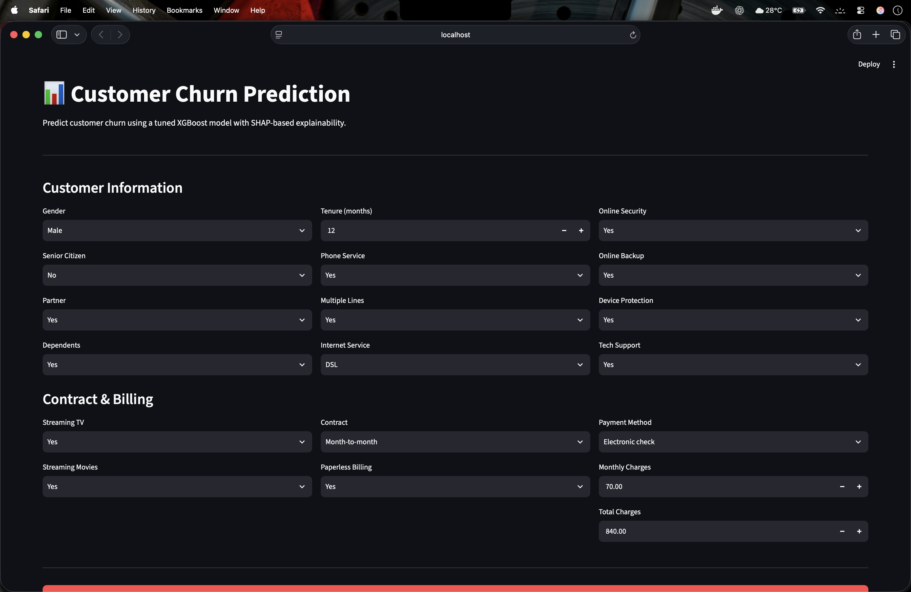
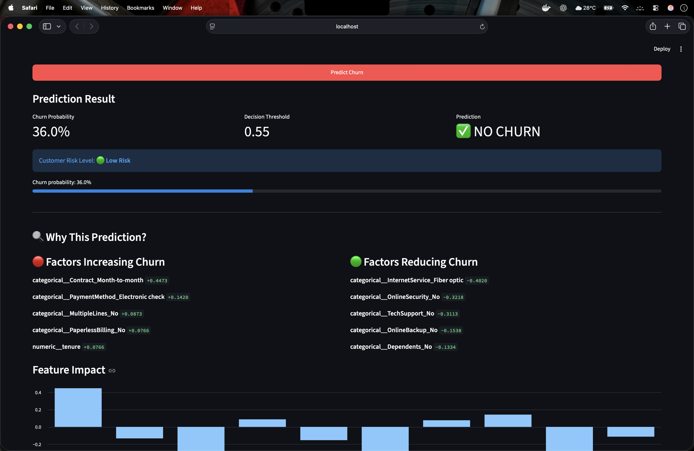
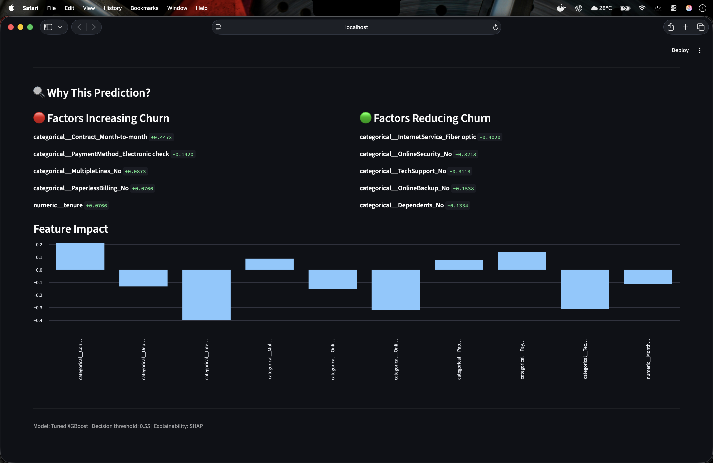

# Customer Churn Prediction

An end-to-end machine learning project for predicting customer churn using XGBoost, ensemble learning, SHAP explainability, Streamlit, and Docker.

## 🚀 Project Overview

This project predicts whether a telecom customer is likely to churn based on customer demographics, services, contract information, and billing characteristics.

The project follows a complete machine learning workflow:

- Data inspection
- Exploratory Data Analysis
- Data preprocessing
- Baseline modeling
- Ensemble modeling
- XGBoost modeling
- Hyperparameter tuning
- Model comparison
- Probability threshold optimization
- SHAP explainability
- Interactive prediction dashboard
- Docker deployment

## 🧠 Machine Learning Pipeline

```text
Telco Customer Data
        ↓
Data Inspection
        ↓
Data Cleaning
        ↓
Train / Test Split
        ↓
Feature Preprocessing
        ↓
Logistic Regression
        ↓
Random Forest
        ↓
Gradient Boosting
        ↓
XGBoost
        ↓
Hyperparameter Tuning
        ↓
Threshold Optimization
        ↓
SHAP Explainability
        ↓
Streamlit Dashboard
        ↓
Docker Deployment
| Model | Purpose |
|---|---|
| Logistic Regression | Baseline model |
| Random Forest | Ensemble learning |
| Gradient Boosting | Boosting model |
| XGBoost | Advanced gradient boosting |

Evaluation Metrics
- Accuracy
- Precision
- Recall
- F1 Score
- ROC-AUC
🔍 Explainable AI
SHAP is used to explain both global and individual predictions.
The project identifies:
- Features increasing churn risk
- Features reducing churn risk
- Feature importance
- Customer-level prediction factors
🖥️ Interactive Dashboard
The Streamlit dashboard allows users to enter customer information and receive:
- Churn probability
- Churn / No Churn prediction
- Risk classification
- Decision threshold
- SHAP-based explanation
```
```customer-churn-prediction/
│
├── app/
│   └── streamlit_app.py
│
├── data/
│   └── raw/
│
├── images/
│   └── dashboard.png
│
├── models/
│   ├── final_model_config.joblib
│   ├── gradient_boosting.joblib
│   ├── logistic_regression.joblib
│   ├── preprocessor.joblib
│   ├── random_forest.joblib
│   ├── xgboost.joblib
│   └── xgboost_tuned.joblib
│
├── reports/
│
├── src/
│   ├── 01_data_inspection.py
│   ├── 02_preprocessing.py
│   ├── 03_eda.py
│   ├── 04_baseline_model.py
│   ├── 05_random_forest.py
│   ├── 06_gradient_boosting.py
│   ├── 07_xgboost.py
│   ├── 08_model_comparison.py
│   ├── 09_final_model_selection.py
│   └── 10_shap_explainability.py
│
├── .dockerignore
├── .gitignore
├── Dockerfile
├── README.md
└── requirements.txt
```
🛠️ Tech Stack
- Python
- Pandas
- NumPy
- Scikit-learn
- XGBoost
- SHAP
- Matplotlib
- Seaborn
- Streamlit
- Docker
📌 Dataset
IBM Telco Customer Churn dataset.
The dataset contains customer demographics, subscribed services, contract information, billing information, and churn status.
🎯 Business Objective
Customer churn prediction can help organizations identify customers at higher risk of leaving and support targeted retention strategies.
The model's probability threshold can be adjusted depending on the business cost of false positives and false negatives.
## 📸 Application Screenshots

### 1. Dashboard

The interactive dashboard allows users to enter customer demographics, services, contract, and billing information.



### 2. Prediction

The prediction view displays the customer's churn probability, decision threshold, prediction result, and overall risk level.



### 3. Analysis

The analysis view provides SHAP-based explanations showing which features increase or decrease the customer's churn risk.



